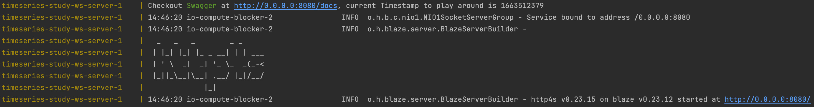
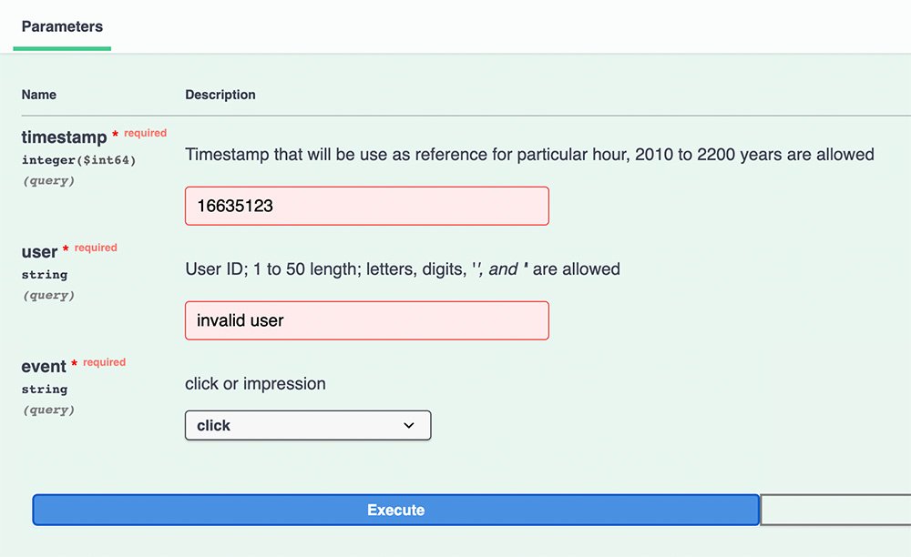
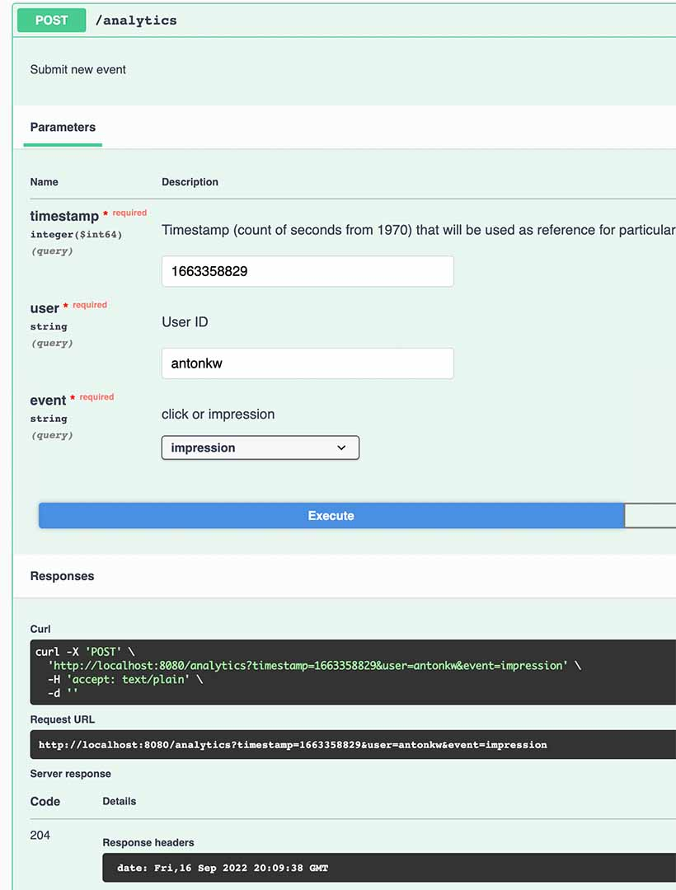

# Env

# App

Requirements:

- Docker
- SBT
- JDK 11+ (libraries require class file version 55+)

## Run with Docker

Fully dockerized running is preferable since it fixes JDK for running the app.

### Basic JDK image

``` 
docker build -t jdk17-curl modules/
```

Verify:
`docker images | grep jdk17` or `docker images | rg jdk17`

### Build Docker image with app

``` 
sbt docker:publishLocal
```

### Build whole env

``` 
docker compose build --no-cache
```

### Run

Both DB and App will be in place after the command:

``` 
docker compose up
```

You can notice that app tries to connect earlier than necessary. It
causes `java.net.ConnectException: Connection refused
`. Healthcheck for Timescale should be improved. Docker restarts it, and it should be ok after the second round.
You will see following lines:

Feel free copy current timestamp and click the link to play around with the app.

Validation is lifted to Swagger automatically, it helps to not send invalid requests.


Feel free to send requests directly:

```
curl -X 'POST' \
  'http://0.0.0.0:8080/analytics?timestamp=16512379&user=anton&event=click' \
  -H 'accept: text/plain' \
  -d ''
```

Responses are helpful and will let you know what went wrong:

``` 
Invalid value for: query parameter timestamp (expected value to be greater than 1262300400, but was 123)
```

## Run with SBT

### Build Env

```
docker compose build --no-cache
docker-compose up -d timescaledb
```

### Run app

``` 
sbt run 
```

## Int test

Ensure that DB is UP and running:

```
docker compose build --no-cache
docker-compose up -d timescaledb
```

Run tests:

``` 
sbt IntegrationTest/test
```

Please note that test cases are cleaning DB. So, DB will be emptied.

# Endpoints

## Swagger

[http://localhost:8080/docs](http://localhost:8080/docs) is full-featured Swagger.



# Description

The project leverages features of [Timescale](https://www.timescale.com/). It is a product built on the top of Postgres.

## Core table.

There is one core table.

``` 
CREATE TABLE event_history
(
    id         UUID       NOT NULL DEFAULT gen_random_uuid(),
    event_time TIMESTAMP  NOT NULL,
    username   TEXT       NOT NULL,
    event_type event_type NOT NULL
);
```

That table is converted to "hypertable" with "1 hour" chunk interval. Which means that the latest hour is being
persisted in separate table and also located in the memory.

```sql
SELECT *
FROM create_hypertable('event_history', 'event_time');

SELECT set_chunk_time_interval('event_history', INTERVAL '1 hour');
```

## Continuous aggregations

Continuous aggregations allow to maintain fast access to per-hour aggregates.

Writings are still fast. Re-calculations are happening as schedules background jobs.

So, for old data we have a chance to observe slightly outdated report.

But the latest hour is actual. It is necessary to denote that there is still no full-scan even of the latest chunk.
Materialized aggregate is being taken into account, and only delta (new records) undergo per-request processing.

```sql
CREATE
MATERIALIZED VIEW events_summary_hourly
    WITH (timescaledb.continuous) AS
SELECT count(distinct username)                                   AS unique_users,
       sum(case when event_type = 'click' then 1 else 0 end)      AS total_clicks,
       sum(case when event_type = 'impression' then 1 else 0 end) AS total_impressions,
       time_bucket(INTERVAL '1 hour', event_time)                 AS bucket
FROM event_history
GROUP BY bucket;

SELECT add_continuous_aggregate_policy(
               'events_summary_hourly',
               start_offset = > INTERVAL '1 month',
               end_offset = > INTERVAL '1 h',
               schedule_interval = > INTERVAL '10 s');
```

```

```